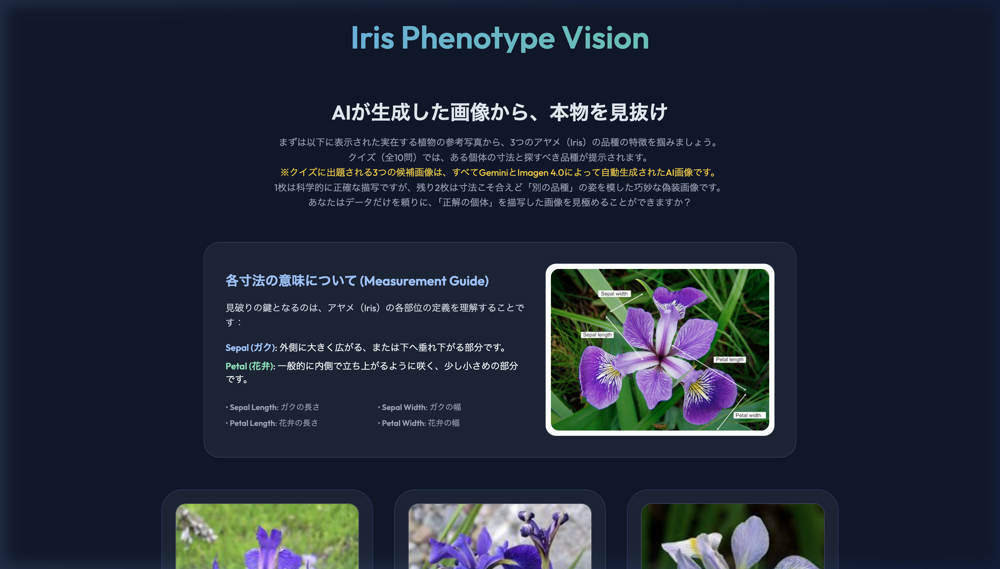
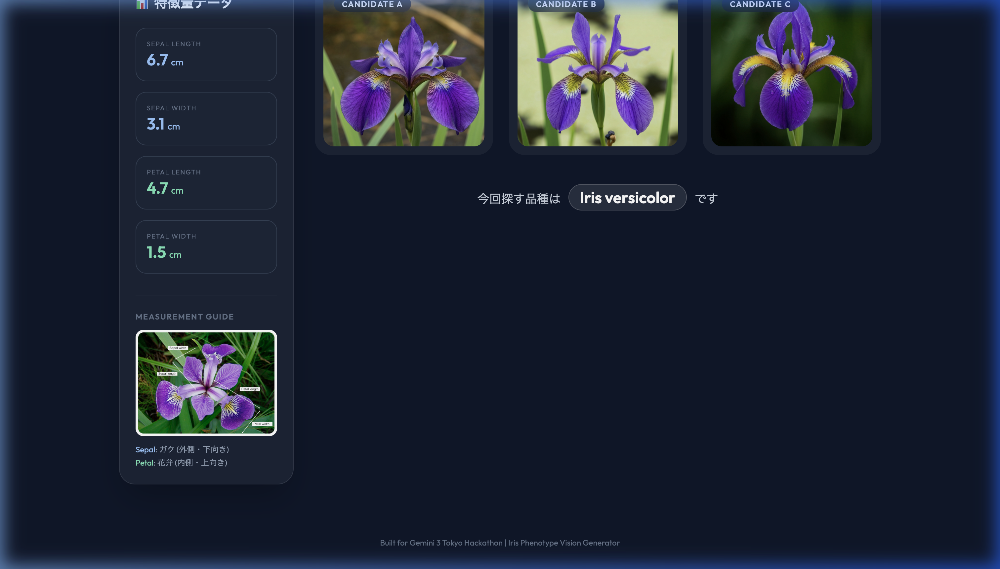
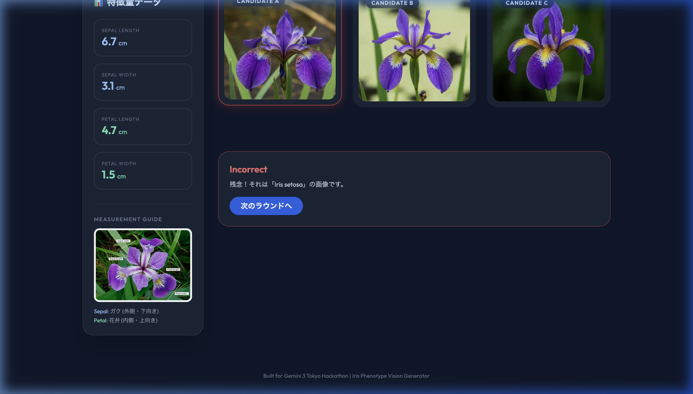

# Iris Phenotype Vision Generator

This project was built for the [Gemini 3 Tokyo Hackathon](https://cerebralvalley.ai/e/gemini-3-tokyo-hackathon). It transforms the classic Iris dataset into a challenging, visual 10-round quiz game powered entirely by Google's generative AI models.

## Overview / 概要

**Iris Phenotype Vision Generator** is a browser-based game where players must identify true botanical images from AI-generated "deceptive" counterparts, relying purely on statistical features (Sepal Length/Width, Petal Length/Width).

**Game Loop:**
1. **Home Screen / トップ画面**: Learn the physical characteristics of the three Iris species using *real, public botanical reference photographs*.
   （実在する植物の参考写真を使って、3つのアヤメの品種の特徴を学習します。）
2. **Quiz Phase (10 Rounds) / クイズフェーズ**: In each round, you are given the specific measurements of an individual flower and told which species you are looking for. **IMPORTANT: All 3 candidate images from this point forward are entirely AI-generated by Gemini 3.1 Pro and Imagen 4.0.**
   （各ラウンドで、ある個体の寸法と探すべき品種が提示されます。**重要：ここから先のクイズで表示される3つの候補画像は、すべてGemini 3.1 ProとImagen 4.0によって自動生成されたAI画像です。**）
3. **The Challenge / 挑戦**: You are presented with 3 macro-photography style images. One is an AI-generated, scientifically accurate representation of those measurements. The other two are AI-generated "deceptive" images—technically perfect generations representing the measurements, but styled as the *wrong* species.
   （マクロ写真風の画像が3枚提示されます。1枚は寸法を科学的に正確に表現したAI生成画像です。残りの2枚はAIが生成した「偽装」画像であり、寸法は正確ですが「別の品種」として描かれています。）
4. **Scoring / スコアリング**: Correctly identifying the true image earns points, with specialized feedback provided for incorrect guesses based on the generated deceptive prompt.
   （本物の画像を正しく見分けるとポイントを獲得し、間違えた場合は生成された偽装プロンプトに基づく専用のフィードバックが表示されます。）

## Screenshots / 画面イメージ

**Home Screen / トップ画面**


**Quiz Phase (Round 1) / クイズフェーズ**


**Scoring & Feedback / フィードバック**


## Architecture / アーキテクチャ

This project leverages two distinct AI models working in sequence to create the game assets:
1. **Gemini 3.1 Pro (`gemini-pro-latest`)**: Acting as a "Botanical Expert", it samples real statistical data from the Iris dataset and generates three distinct, highly detailed visual prompts (one accurate, two deceptive) without any embedded text or labels.
2. **Imagen 4.0 (`imagen-4.0-fast-generate-001`)**: Reads the prompts generated by Gemini 3.1 Pro and produces photorealistic, text-free images that serve as the visual choices for the quiz.

The frontend is a lightweight, responsive Single Page Application built with *Vanilla JavaScript* and *TailwindCSS*.

## Setup / セットアップ

To generate new game data and assets locally:

1. Clone the repository / リポジトリをクローンします:
   ```bash
   git clone https://github.com/YukiHSun/Hackathon-Tokyo-craft.git
   cd Hackathon-Tokyo-craft
   ```

2. Create a `.env` file and add your Google AI Studio API key / `.env` ファイルにAPIキーを設定します:
   ```env
   GEMINI_API_KEY=your_api_key_here
   ```

3. Install requirements / 依存関係をインストール:
   ```bash
   conda create -n py312 python=3.12
   conda activate py312
   pip install pandas google-generativeai python-dotenv requests
   ```

4. Generate the `rounds_data.json` / 最新のプロンプトデータを生成:
   ```bash
   python iris_server.py
   ```

5. (Optional) Batch generate 30 new images using Imagen 4.0 / 画像の再生成:
   ```bash
   python batch_generate_images.py
   ```

6. Play the game! / ブラウザで起動:
   Simply open `index.html` in your web browser.
